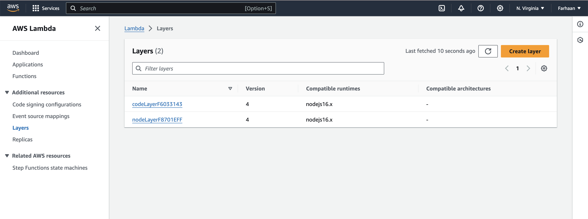

## Serverless REST Assignment.

__Name:__ Farhaan Kaleem

__Video demonstration:__ https://youtu.be/_SGfLE6eV2A

This repository contains an implementation of a serverless REST API for the AWS platform. The CDK framework is used to provision its infrastructure. The API's domain context is movie reviews.

### API endpoints.
 
+ POST /movies/reviews - add a movie review.
+ GET /movies/{movieId}/reviews - Get all the reviews for a movie with the specified id.
+ GET /movies/{movieId}/reviews?minRating=n - Get all the reviews for the film with the specified ID whose rating was higher than the minRating.
+ GET /movies/{movieId}/reviews/{reviewerName} - Get the review for the movie with the specified movie ID and written by the named reviewer.
+ PUT /movies/{movieId}/reviews/{reviewerName} - Update the text of a review.
+ GET /movies/{movieId}/reviews/{year} - Get the reviews written in a specific year for a specific movie.
+ GET /reviews/{reviewerName} - Get all the reviews written by a specific reviewer.
+ GET /reviews/{reviewerName}/{movieId}/translation?language=code - Get a translated version of a movie review using the movie ID and reviewer name as the identifier.

Please see that all the requested endpoints were deployed into AWS.

### Authentication (if relevant).

Please find a screenshot from the AWS management console (Cognito User Pools) showing a confirmed user account with username "userA".

### Independent learning (If relevant).

#### Review Translation ####

For review translation, the parameters were firstly extracted from pathParameters and queryStringParameters. After checking the validity of the each argument passed, query was fired to get the entry from the database. From the output, the review is extracted and translated using TranslateClient and TranslateTextCommand, extracted from @aws-sdk/client-translate. Here was facing the issue of permissions. Hence added the policy named "TranslateFullAccess" to the role. Please find the screenshot for the same. Also for validation  of the language parameter, it was checked that which all languages are supported by AWS, and only they were accepted as a query parameter.

Source File: lambdas/getTranslateReviewFn.ts

#### Multi Stack Application ####

Earlier the file consisted of one main stack. Later, I saw that it can be broken more precisely into auth and app stacks. Hence now we have three stacks. One main stack named "AuthAppStack" and other stacks within it called "AppApi" and "AuthServiceApi". Things learnt were how can we have multi stacks and how do we manage different APIs with different root urls. Please find the screenshot showing all the stacks.

Source Files: 

+ lib/auth-app-stack.ts
+ lib/auth-api.ts
+ lib/app-api.ts

Each of these source files represents one stack each.

#### Multi Layered Application ####

Lambda layers was a totally new concept introduced through this assignment. Study was carried out on how can the layers for both the node module and custom code can be applied. For node module layer, the library called "@aws-sdk/client-dynamodb" was put in the layer. The reason for this is that this library was used in many files to interact with the Database. For custom code layer, the "types.schema.json", which is used in most of the lambda functions to validate the inpit from the user is placed in the layer. Also learnt how to make the layer when the stack is deployed, attach the layers with the lambda functions needing it and destroy when the stack is destoryed. The name of the layers are: nodeLayer and codeLayer. Please find the screenshot of the lambda layers.

Source Files: 

Layers configurations were done in the following files:
+ lib/auth-app-stack.ts
+ lib/app-api.ts

Layers were used in many files, one of these files are:
+ lambda/addMovieReview.ts

In this file, it is observed that "DynamoDBClient" is imported. But it has never been installed and hence has no entry in package.json. Also it is observed that how the const schema is read from the path in AWS Layer.

